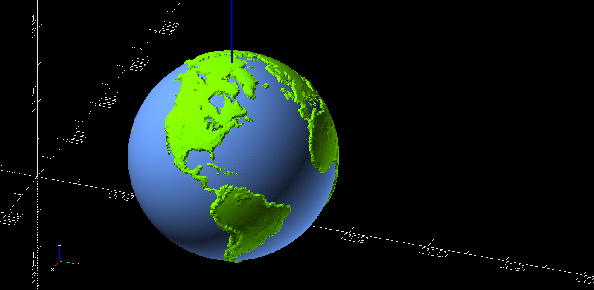

# My journey in building an equatorial platform

## Why?!
I want to see what I can do with the telescope my kids got for Christmas.  It’s great for seeing things but objects move so fast.  And I find I really like taking pictures.  Better pictures require more time for exposure.  More time means moving the scope to stay on target longer.

## What is an equatorial platform?
"An **equatorial platform** or equatorial table is an equatorial telescope mount in the form of a specially designed platform that allows any device sitting on it to **track astronomical objects** in the sky **on an equatorial axis**." 
https://en.wikipedia.org/wiki/Equatorial_platform 

You live on earth.  Earth isn’t stationary.  When we see the stars move at night it is because of the spin of the earth on its axis (blue).

When trying to _compensate for the movement of the earth_ when looking at celestial objects (moon, planets, stars, nebula, etc) you need something to move you in opposition of that rotation.  If you draw a line directly from where you are toward polar north (or south if in the southern hemisphere) and then draw a cone (yellow) around that such that the cone is perpendicular to the ground, you have the rotation you need.

You need something to move your reference to negate the spin from the planet.  There are many ways to do this, one is an [equatorial platform](https://en.wikipedia.org/wiki/Equatorial_platform).

Ultimately you'll have a platform with two parts, a top and bottom.  This platform rotates around the axis.  The bottom houses bearings and one or more motors.  The top is where the telescope rests and is what is moved by the motor(s).  

TODO: picture of final platform, maybe animated gif?

# What do you need to know?
You can’t just make one unless you have some software to do the math and hardware to make the final product.  There are companies that will do that for you, but they tend to be for larger scopes than I have and cost a LOT more money than I want to spend (5x more than my scope is new).

So, learn some things and do some math and you can make the platform.  There isn’t a single post on the interwebs that had all I needed.  This section hits the high points of the things I needed to learn.

## Trigonometry
Ok, I lied.  I know this.  But if you don’t you’ll need to do some reading.  If you’re looking at building this platform yourself you very likely know this is important.  If you didn’t this is the foundation by which you calculate all the things for this platform.  You need to know it..  I reference the wikipedia’s Trigonometry page to make sure I have it right, but also remember sohcahtoa.

## Center of Gravity (CoG)
When you put your telescope on a platform that will tilt it is good to know the telescope will not fall over.  Therefore knowing the center of gravity (CoG) is critical.  After a lot of reading and musing about this I settled on a simple calculation that will approximate CoG well enough.  But what if you want to know the real CoG for the finished product?  Ok, you can do that..

### CoG: The Hard Way
Take the top of the equatorial platform and secure it to the bottom of your telescope rocker box in the position it would be when being used.  Make sure NOTHING will come loose cause it’s going to get interesting…  Find an eyebolt in a ceiling or some other stable structure you can hang the whole assembly on.  Tie a line strong enough to carry the weight of the scope plus platform.  Pick a point on the bottom of the platform and suspend the whole assembly upside down from the ceiling.  Note the line straight down from that point through the suspended apparatus.  Take it all down, pick another point, and do it again.  The CoG is where the two points intersect.

Not having done this method I would setup a camera to take a picture of each one of these sessions and then hack around in some image software, probably GIMP, to find where things intersect.  If nothing else, eyeball it to get a rough CoG height.  Note this method will get you the distance from the bottom of the equatorial platform board.  The “Easy Way” method uses the bottom of the cone which is NOT THE SAME THING.  You can fix this by adding some known height to the value you calculated / eyeballed and call it a day.
