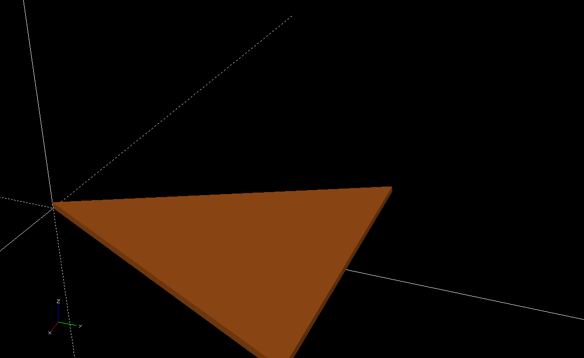
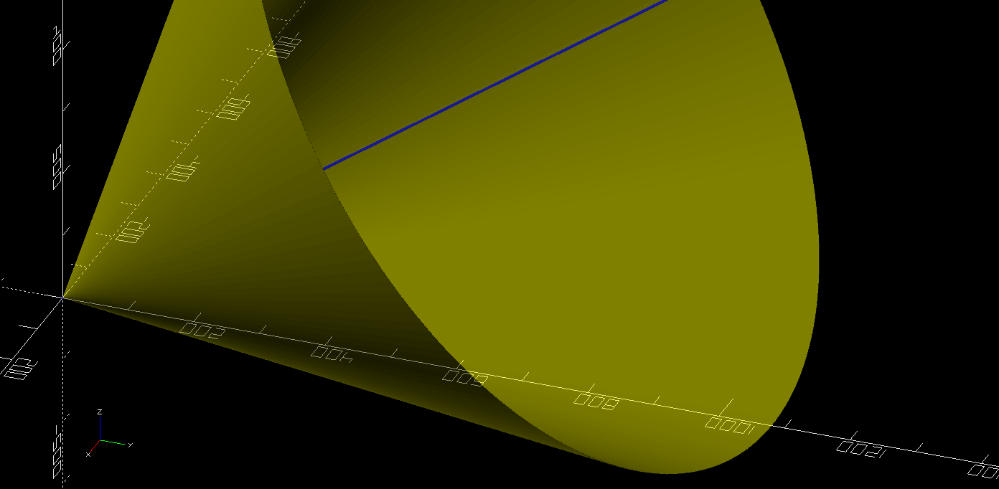
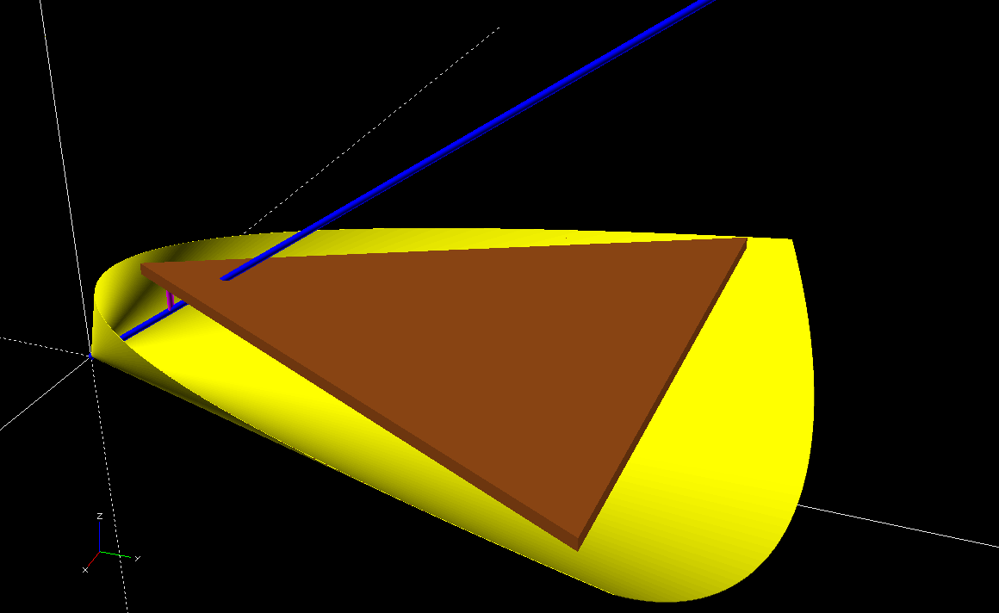
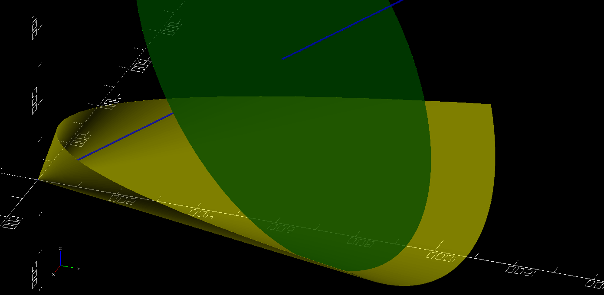
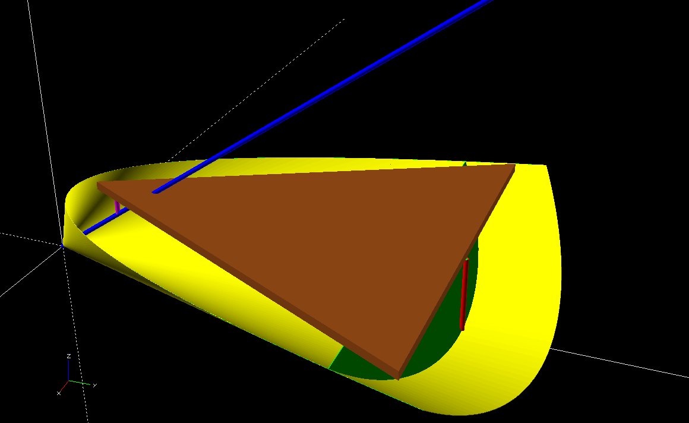
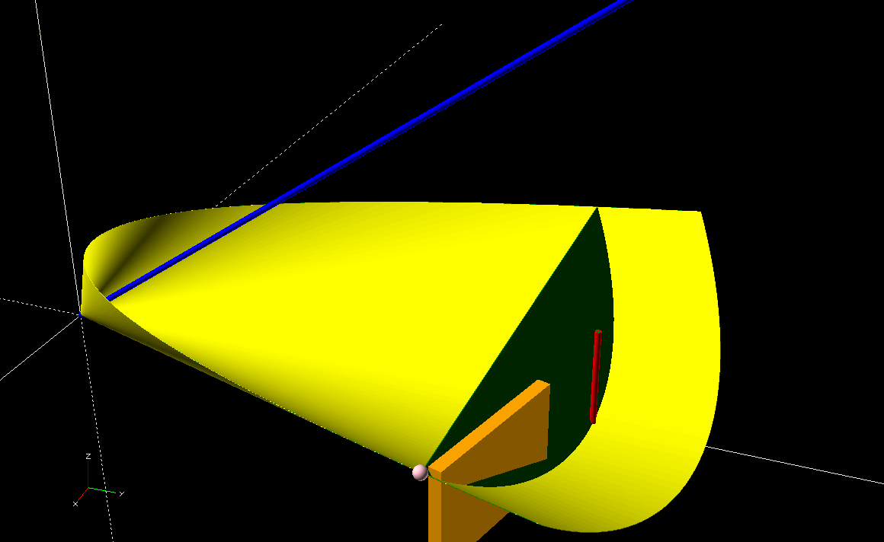
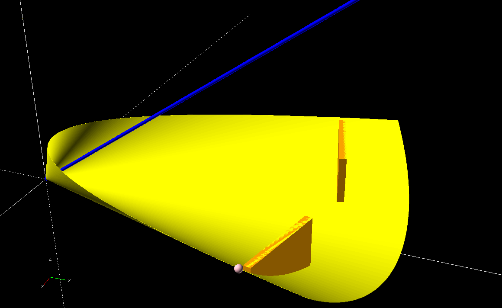
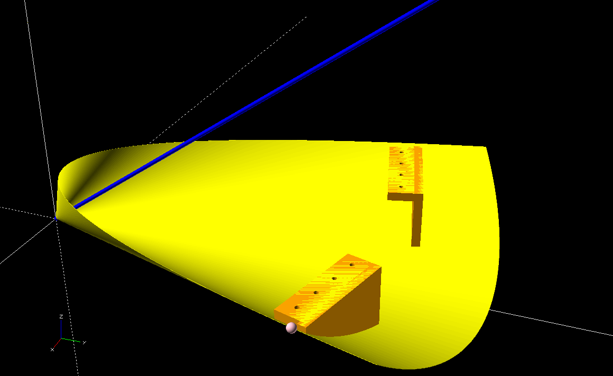

# Model: Top Platform

## Basic Platform
For the purposes of this document the platform (brown) is represented as a triangle.  In practice it can be whatever shape you like so long as it’s heavy enough and your telescope fits on it.

## Our Cone
The foundation of an equatorial platform is spilling a cone (yellow) to compensate for earth’s rotation.  So we take the latitude where the platform is going to be used and start with a cone on its side with the center axis (blue) raised at the latitude.

## South Bearing
The entire model depends on this platform, south bearing pivot pin (purple), and the distance the bottom and top of the platforms are from each other at the north bridge (not built yet).

## Platform / Cone Cross Section
With this critical information we can find the intersection of the bottom of the platform with the cone.  This is the plane with the platform positioned off the bottom of the cone with the south bearing pivot pin touching the axis.  We illustrate this by cutting the top of the cone off showing the parabola edge.

## Rotation
Things get interesting now!  We want to design the north bridge. At the north bridge we have movement along a curve.  This movement means a lot of moving forces and ideally we have the forces go straight down.  This will also simplify where this curve rests (and moves) on the bottom platform.  To find this curve that intersects the cone directly under the middle of the north edge of the platform and is perpendicular to the axis.  In this picture a slice of the circle (green) is shown with the platform removed for better viewing.

## Platform with Rotation
To verify, we can review the model with the platform (brown) added in, the circle (green) cut, and a rod (red) indicating the circle under the platform edge lines up.

## Point on Parabola
That looks fancy and complicated.  But why do we care?  We want a vertical north bearing.  For that we are going to find where the circle in the picture above ends on the cone.  Meaning, the point (pink) on the parabola that intersects with the circle.  From that point we’ll create a curve towards where the cone (red) intersects with the circle.

## Adjusted Platform
Except… this isn’t what we really want.  We want the curve from where the green circle intersects the cone between platform edges.  And we have to consider we’re not making the full curve since we’ll never be able to use the middle portion.

Ok, this needs to be adjusted!  We need to line up the circle with the east and west edges of the platform.  I’m going to optimize a little bit.  I know I won’t have a triangular corner on my platform.  So I’m going to simply square the north edge corners. I’ll use the intersection of the circle on the parabola since it’s close enough to what I want and can be consistently calculated from the input we already have.

## North Curve: Rough
Now we’ll build the north curve.  Finally!  Deep breath.. we move to “close enough” territory now.  Drop a rectangle (orange) along the edge from the circle/parabola/platform intersection (pink) towards the rod (red).  Limit the width to the print area assuming you can print the height.

Note the north rectangle (green) does not touch the full circle (green).  You would need to adjust the height of this part to get it to hit all bits of the curve.  Remember, we’re trying to have forces go straight down from the platform.  The simplest approximation of this is to base it on a flat orientation.

## North Curve: Good Enough
There are some thing that could be optimized about this.  But keep in mind this is about rotating around the axis (blue).  And we have the cone (yellow) that provides a surface.  If we simply ensure that our north curve (orange) roles on something that represents the outside of the cone we’re good.  So I leave optimizations to the read and am going with the theory that this is “good enough”.

## North Curve: Supports
On the off chance it’s not good enough we can ensure the platform can take adjustments.  As you may have noticed in the earlier picture, the circle (green) is in front of the north curve (orange).  We’ll build the mounting hardware relative to the point on the parabola (pink) so adjustments will just screw in to replace the old part.  Use the washer diameter to limit the printed horizontal support structure.  It doesn’t add value if it’s not being held by something.
